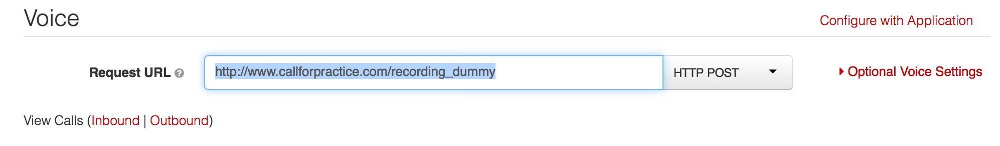

## Introduction

[Call for Practice](http://www.callforpractice.com) is a mobile web site and interactive telephone experience that helps sales people practice their sales pitch.

The application was originally built by [@barelyknown](https://twitter.com/barelyknown) as part of the [Salesforce $1 Million Hackathon at Dreamforce 2014](https://developer.salesforce.com/million-dollar-hackathon).

To learn more about the service from a user's point of view, try it out at [www.callforpractice.com](http://www.callforpractice.com).

## Open Source
Call for Practice is released as open source software under the simple and permissive [MIT License](/LICENSE).

Feel free to hack on it to meet your needs. Want to contribute? :thumbsup:

The application is small and hacked together very quickly, but it also is a good example of a number of Rails and Twilio concepts without being too difficult to understand.

## Twilio Requirements
Twilio is used for voice and messaging capabilities. **If you host the application yourself**, you will need to [sign up for a Twilio account](https://www.twilio.com/try-twilio). Once you've done that, you'll need to add four environment variables:

- `TWILIO_ACCOUNT_SID` Account SID from your Twilio account settings.
- `TWILIO_AUTH_TOKEN`: Auth Token from your Twilio account settings.
- `TWILIO_APP_PHONE_NUMBER`: The phone number that is used send confirmation codes from the system.
- `TWILIO_RECORDING_PHONE_NUMBER`: The phone number that is used to record responses over the phone.

If you're hosting on Heroku, adding an environment variable looks somethink like this:

`heroku config:set TWILIO_APP_PHONE_NUMBER=+15005550006`

Also, you'll need to set the request url for the phone number that you set as the `TWILIO_RECORDING_PHONE_NUMBER` for your application to `https://your.application.host/recording_dummy` where `your.application.host` is, well, your application host (like `www.callforpractice.com`).

## Deploy on Heroku

